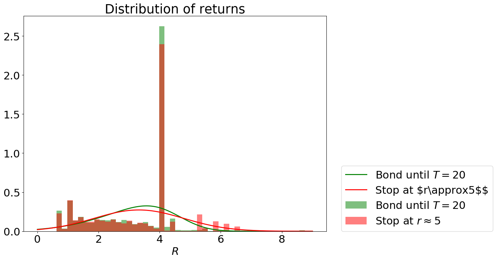

# gym-OptionPricing

Environment referenced in;
[CHOW, Yinlam, et al. Risk-constrained reinforcement learning with percentile risk criteria. Journal of Machine Learning Research, 2018, 18.167: 1-51.]

[TAMAR, Aviv; DI CASTRO, Dotan; MANNOR, Shie. Policy gradients with variance related risk criteria. In: Proceedings of the twenty-ninth international conference on machine learning. 2012. p. 387-396.]

[CHOW, Yinlam; GHAVAMZADEH, Mohammad. Algorithms for CVaR optimization in MDPs. In: Advances in neural information processing systems. 2014. p. 3509-3517.]

## Installation

```shell
git clone https://github.com/hannese/gym-SafeRL.git
cd envs/gym-OptionPricing
pip install -e .
```
## Usage

```python
import gym
import gym_OptionPricing
import numpy as np

num_episodes=10

for i in range(num_episodes):
  env = gym.make("OptionPricing-v0")
  obs = env.reset()
  while(True):
    action = env.action_space.sample()
    nextObservation, reward, done, info = env.step(action)

    if done:
      env.close()
      break
```




